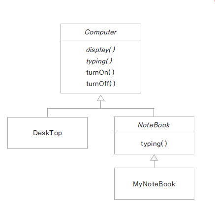

## 01. 객체 간의 상속?
### 클래스 상속
- 새로운 클래스를 정의 할 때 이미 구현된 클래스를 상속 받아서 속성이나 기능을 확장하여 클래스를 구현함
- 이미 구현된 클래스보다 더 구체적인 기능을 가진 클래스를 구현해야 할 때 기존 클래스를 상속함
- 자바는 단일 상속만을 지원 -> 여러가지 클래스를 상속받으면 모호해진다
- extends 키워드 뒤에는 단 하나의 클래스를 올 수 있음
### 상속 구현 하는 경우
- 상위 클래스는 하위 클래스 보다 더 일반적인 개념과 기능을 가짐
- 하위 클래스는 상위 클래스 보다 더 구체적인 개념과 기능을 가짐
- 하위 클래스가 상위 클래스의 속성과 기능을 확장 (extends)한다는 의미
## 02. 상속을 활용한 멤버십 클래스 구현하기
### 일반 고객 클래스 구현
- 고객의 속성: 고객 아이디, 고객 이름, 고객 등급, 보너스 포인트, 보너스 포인트 적립비율
- 일반 고객의 경우 물품 구매시 1%의 보너스 포인트 적립

## 03.상속에서 클래스 생성 과정과 형 변환
### 하위 클래스가 생성 되는 과정
- 하위 클래스를 생성하면 상위 클래스가 먼저 생성됨
- new VIPCustomer()를 호출하면 Customer()가 먼저 호출 됨
- 클래스가 상속 받은 경우 하위 클래스의 생성자에서 반드시 상위 클래스의 생성자를 호출함

### Super
- 하위 클래스에서 가지는 상위 클래스에 대한 참조값
- super()는 상위 클래스의 기본 생성자를 호출 함
- 하위 클래스에서 명시적으로 상위 클래스의 생성자를 호출하지 않으면 super()가 호출
- 상위 클래스의 기본 생성자가 없는 경우 하위 클래스에서는 생성자에서는 super를 이용해 ㅇ명시적으로 상위 클래스의 생성자 호출
### 형 변환
```
Customer customerLee = new VIPCustomer(); // 상위 클래스로 변수를 선언하고 하위 클래스의 생성자로 인스턴스 생성
```

## 04. 메서드 재정의하기 (overiding)
### 하위 클래스에서 메서드 재정의 하기
- 오버라이딩 : 상위 클래스에 정의된 메서드의 구현 내용이 하위 클래스에서 구현할 내용과 맞지 않는 경우 하위 클래스에서 동일한 이름의  메서드를 재정의 할 수 있음
- VIP Customer 클래스의 calPrice()는 할인율이 적용되지 않음
- 재정의 하여 구현해야함


## 07. 상속은 언제 사용?
### IS-A 관계 (is a relationship : inheritance)
- 일반적인(general) 개념과 구체적인(specific) 개념과의 관계
- 상위 클래스 : 하위 클래스보다 일반적인 개념 ( 예: Employee )
- 하위 클래스 : 상위 클래스보다 구체적인 개념들이 더해짐 ( 예: Engineer, Manager...)
- 상속은 클래스간의 결합도가 높은 설계
- 상위 클래스의 수정이 많은 하위 클래스에 영향을 미칠 수 있음
- 계층구조가 복잡하거나 hierarchy가 높으면 좋지 않음
### HAS-A 관계 (composition)
- 클래스가 다른 클래스를 포함하는 관계 ( 변수로 선언 )
- 코드 재사용의 가장 일반적인 방법
- Student가 Subject를 포함하는
- Library를 구현할 때 ArrayList 생성하여 사용
- 상속하지 않음

## 08. 다운 캐스팅과 instanceof
### 다운 캐스팅
- 업캐스팅된 클래스를 다시 원래의 타입으로 형 변환
- 하위 클래스로의 형 변환은 명시적으로 해야 함
### instanceof를 이용하여 인스턴스의 형 체크
- 원래 인스턴스의 형이 맞는지 여부 체크

## 09. 추상 클래스 (abstract class) 구현
### 추상 클래스?
- 구현 코드 없이 메서드의 선언만 있는 추상 메서드(abstract method)를 포함한 클래스
- 메서드 선언(declaration) : 반환타입, 메서드 이름, 매개변수로 구성
- 메서드 정의(definition) : 메서드 구현(implementation)과 동일한 의미 구현부(body) 를 가짐 ({ })
- abstract 예약어를 사용
- 추상 클래스는 new 할 수 없음 ( 인스턴스화 할 수 없음 )
### 추상 클래스 구현
- 메서드에 구현 코드가 없으면 abstract 로 선언
- abstract로 선언된 메서드를 가진 클래스는 abstract로 선언
- 모든 메서드가 구현 된 클래스라도 abstract로 선언되면 추상 클래스로 인스턴스화 할 수 없음
- 추상 클래스의 추상 메서드는 하위 클래스가 상속 하여 구현
- 추상 클래스 내의 추상 메서드 : 하위 클래스가 구현해야 하는 메서드
- 추상 클래스 내의 구현 된 메서드 : 하위 클래스가 공통으로 사용하는 메서드 ( 필요에 따라 하위 클래스에서 재정의 함 )


- italics : abstract
- normal : 구현된 메서드
- 추상 클래스를 상속받은 클래스는 추상 클래스에서 선언된 추상 메서드를 implementation을 해야할 책임이 있다. 안하면 다시 추상 클래스가 됨.

## 10. 추상 클래스의 응용 - 템플릿 메서드 패턴
### 템플릿 메서드 
- 추상 메서드나 구현 된 메서드를 활용하여 코드의 흐름(시나리오)를 정의하는 메서드
- **final로 선언하여 하위 클래스에서 재정의 할 수 없게 함**
- 프레임워크에서 많이 사용되는 설계 패턴
- 추상 클래스로 선언된 상위 클래스에서 템플릿 메서드를 활용하여 전체적인 흐름을 정의 하고 하위 클래스에서 다르게 구현되어야 하는 부분은 추상 메서드로 선언하여 하위 클래스에서 구현 하도록함

## 11. Interface
### 인터페이스란?
- 모든 메서드가 추상 메서드로 선언됨 public abstract
- 모든 변수는 상수로 선언됨 public static final
### 상수
- 모든 변수는 상수로 변환 됨 public static final (자동으로 붙여줌)
### 추상 메서드
- 모든 선언된 메서드는 추상 메서드 public abstract (자동으로 붙여줌)
